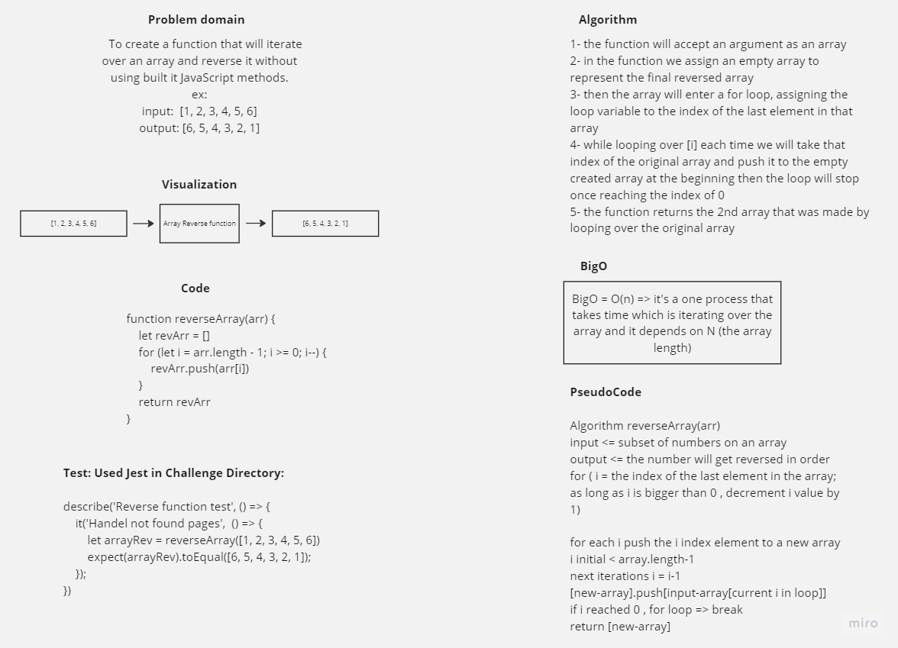
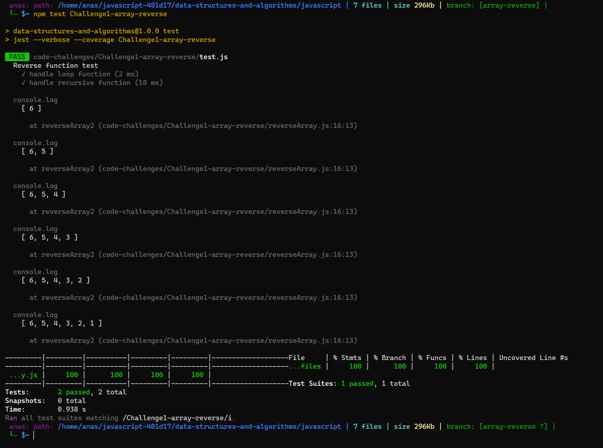

# Code Challenge : Class 01


## array-reverse

the challenge is to write a function that will do for loop on array and return it reversed.

## Whiteboard Process



## Approach & Efficiency
first one using for loop and the second using recursive function, both gave the same result, both has the same BigO = O(n) where n is the array length
## Solution

``` JavaScript

'use strict';

function reverseArray1(arr) {
    let newArr = [];
    for (let i = arr.length - 1; i >= 0; i--) {
        newArr.push(arr[i]);
    }
    console.log(newArr)

    return newArr;
}

function reverseArray2(arr, arr2 = []) {
    if (arr.length === 0) {
        return arr2;
    }
    arr2.push(arr.pop());
    console.log(arr2)
    return reverseArray2(arr, arr2);
}
module.exports = {
    reverseArray1,
    reverseArray2
};
```




### to test run ( npm test Code\ Challenge\ 1\ reverseArray/ )