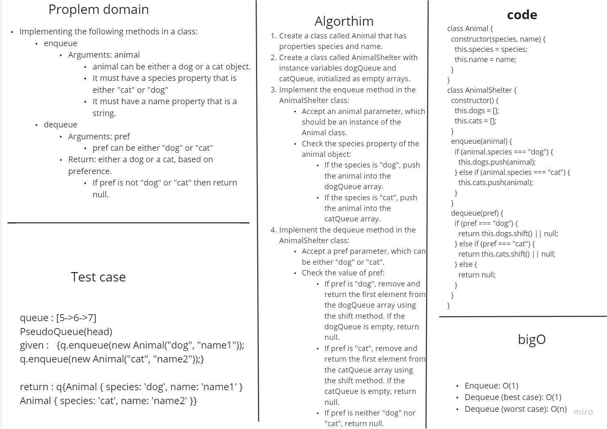

# Stack Queue Animal Shelter

## Approach & Efficiency

### Approach

1. Animal class: First, we define a separate Animal class to represent animals in the shelter. The Animal class has two properties: species (either "dog" or "cat") and name (a string).

2. AnimalShelter class: define the main AnimalShelter class to hold the dogs and cats in the shelter. It uses a first-in, first-out (FIFO) approach, which means the animals are enqueued and dequeued based on the order they arrived.

3. enqueue : takes an animal object as an argument. It checks the species property of the animal and adds it to the appropriate queue (dogs or cats). If the species is neither "dog" nor "cat", it ignores the animal.

4. dequeue :takes a pref argument,and It checks the pref value and dequeues the first animal from the corresponding queue (dogs or cats). If the preference is neither "dog" nor "cat", it returns null. If the respective queue is empty, it also returns null.

### Efficiency

1. Enqueue Efficiency: the time complexity of enqueue is O(1).

2. Dequeue Efficiency:If the respective queue is empty, the dequeue operation also takes O(1) time, However In the worst case, when the queue is full, the time complexity of dequeue can be O(n).

## Whiteboard 


## Solution

 ```javascript

class Animal {
  constructor(species, name) {
    this.species = species;
    this.name = name;
  }
}

class AnimalShelter {
  constructor() {
    this.dogs = [];
    this.cats = [];
  }

  enqueue(animal) {
    if (animal.species === "dog") {
      this.dogs.push(animal);
    } else if (animal.species === "cat") {
      this.cats.push(animal);
    }
  }

  dequeue(pref) {
    if (pref === "dog") {
      return this.dogs.shift() || null;
    } else if (pref === "cat") {
      return this.cats.shift() || null;
    } else {
      return null;
    }
  }
}


    ```

