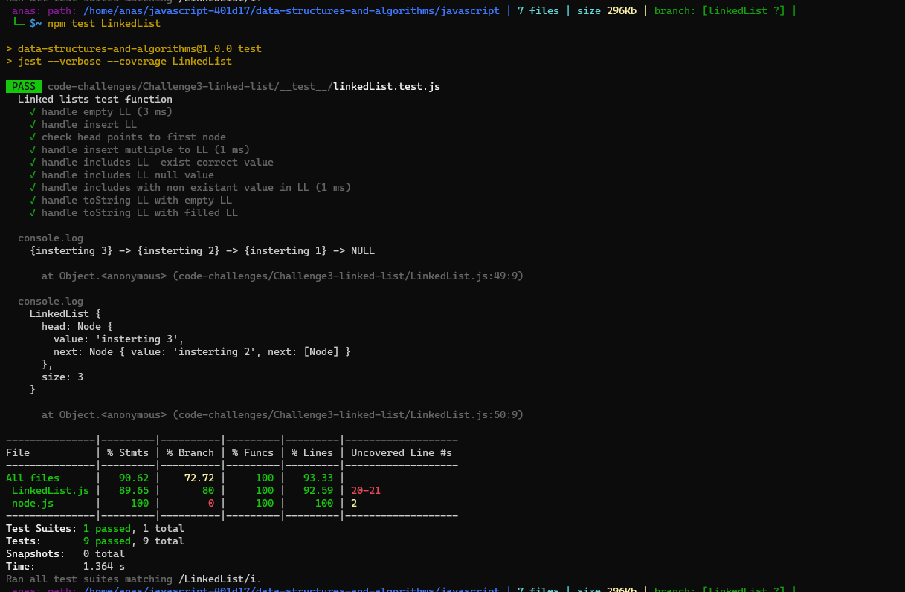

# linked-list

1. Node
- Create a Node class that has properties for the value stored in the Node, and a pointer to the next Node.
2. Linked List
- create a Linked List class
- Within your Linked List class, include a head property.
- Upon instantiation, an empty Linked List should be created.
The class should contain the following methods
A. insert
Arguments: value
Returns: nothing
Adds a new node with that value to the head of the list with an O(1) Time performance.
B. includes
Arguments: value
Returns: Boolean
Indicates whether that value exists as a Node’s value somewhere within the list.
C. to string
Arguments: none
Returns: a string representing all the values in the Linked List, formatted as:
"{ a } -> { b } -> { c } -> NULL"

## Solution

``` javascript
const { Node } = require('./node');

class LinkedList {
  constructor() {
    this.head = null;
    this.size = 0;
  }
  insert(value) {
    this.head = new Node(value,this.head);
    this.size ++;
    
  }

  includes(value){
    let start = this.head;
    if (!this.head){
      return false;
    } else{
      while(start.value && start.value !== value){
        if(start.next === null) return false;
        start = start.next;
      }
      return true;
    }

  }

  toString(){
    let start = this.head;
    if (!this.head){
      return 'empty linked list';
    } else{
      let stringOfValues = '';
      while(start.value){
        stringOfValues += `{${start.value}} -> `;
        if(start.next === null) return stringOfValues += 'NULL';
        start = start.next;
      }
    }
  }
}

```

