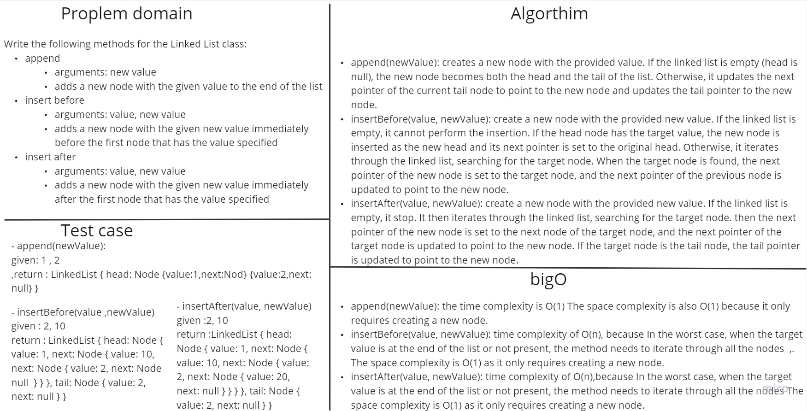

# linked-list-insertions

Write the following methods for the Linked List class:

1.append
arguments: new value
adds a new node with the given value to the end of the list
2.insert before
arguments: value, new value
adds a new node with the given new value immediately before the first node that has the value specified
3.insert after
arguments: value, new value
adds a new node with the given new value immediately after the first node that has the value specified

## Whiteboard



## Solution

``` javascript
class Node {
    constructor(value) {
        this.value = value;
        this.next = null;
    }
}

class LinkedList {
    constructor() {
        this.head = null;
        this.tail = null;
    }

    append(newValue) {
        const node1 = new Node(newValue);

        if (!this.head) {
            this.head = node1;
            this.tail = node1;
        } else {
            this.tail.next = node1;
            this.tail = node1;
        }
    }

    insertBefore(value, newValue) {
        const node1 = new Node(newValue);

        if (!this.head) {
            return; // List is empty
        }

        if (this.head.value === value) {
            node1.next = this.head;
            this.head = node1;
            return;
        }

        let currentNode = this.head;
        while (currentNode.next) {
            if (currentNode.next.value === value) {
                node1.next = currentNode.next;
                currentNode.next = node1;
                return;
            }
            currentNode = currentNode.next;
        }
    }

    insertAfter(value, newValue) {
        const node1 = new Node(newValue);

        if (!this.head) {
            return; // List is empty
        }

        let currentNode = this.head;
        while (currentNode) {
            if (currentNode.value === value) {
                node1.next = currentNode.next;
                currentNode.next = node1;
                if (currentNode === this.tail) {
                    this.tail = node1;
                }
                return;
            }
            currentNode = currentNode.next;
        }
    }
}

```

>to test run (node linked-list-insertions) 