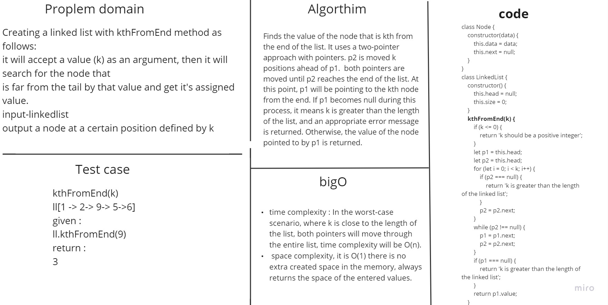
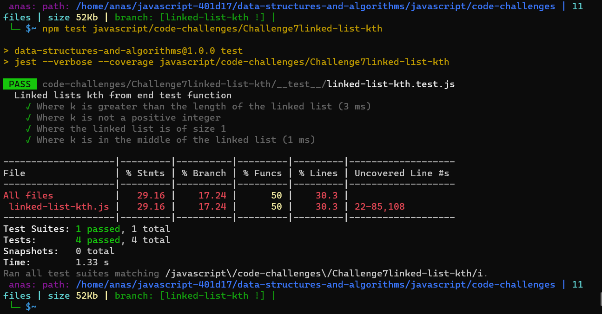

# Linked Lists Kth From End

Creating a linked list with kthFromEnd method as follows:

It will accept a value (k) as an argument, then it will search for the node that is far from the tail by that value and get it's assigned value.

Input : linkedlist

Output: a node at a certain position defined by k

## Whiteboard Process



## Solution

``` javascript
class Node {
    constructor(value, next = null) {
        this.value = value;
        this.next = next;
    }
}

class LinkedList {
    constructor() {
        this.head = null;
        this.size = 0;
    }

    insert(value) {
        this.head = new Node(value, this.head);
        this.size++;
    }

    append(newValue) {
        if (this.head === null) {
            this.head = new Node(newValue, null);
            this.size++;
        } else {
            let iterative = this.head;
            while (iterative.next !== null) {
                iterative = iterative.next;
            }
            iterative.next = new Node(newValue, null);
            this.size++;
        }
    }

    insertBefore(value, newValue) {
        if (this.head === null) {
            this.head = new Node(newValue, this.head);
            this.size++;
        } else if (this.head.value === value) {
            this.head = new Node(newValue, this.head);
            this.size++;
        } else {
            let current = this.head;
            let loopPoint = this.head.next;
            if (loopPoint === null) return console.log('Value Not Found');
            while (value !== loopPoint.value) {
                loopPoint = loopPoint.next;
                current = current.next;
                if (loopPoint === null) return console.log('Value Not Found');
            }
            let newNode = new Node(newValue, loopPoint);
            current.next = newNode;
            this.size++;
        }
    }

    insertAfter(value, newValue) {
        if (this.head === null) {
            this.head = new Node(newValue, this.head);
            this.size++;
        } else if (this.head.value === value) {
            this.head.next = new Node(newValue, this.head.next);
            this.size++;
        } else {
            let loopPoint = this.head.next;
            if (loopPoint === null) return console.log('Value Not Found');
            while (value !== loopPoint.value) {
                loopPoint = loopPoint.next;
                if (loopPoint === null) return console.log('Value Not Found');
            }
            loopPoint.next = new Node(newValue, loopPoint.next);
            this.size++;
        }
    }

    toString() {
        let start = this.head;
        if (!this.head) {
            return 'empty linked list';
        } else {
            let stringOfValues = '';
            while (start.value) {
                stringOfValues += `{${start.value}} -> `;
                if (start.next === null) return stringOfValues += 'NULL';
                start = start.next;
            }
        }
    }

    kthFromEnd(k) {
        if (k <= 0) {
            return 'k should be a positive integer';
        }
        let p1 = this.head;
        let p2 = this.head;
        for (let i = 0; i < k; i++) {
            if (p2 === null) {
                return 'k is greater than the length of the linked list';
            }
            p2 = p2.next;
        }

        while (p2 !== null) {
            p1 = p1.next;
            p2 = p2.next;
        }
        if (p1 === null) {
            return 'k is greater than the length of the linked list';
        }
        return p1.value;
    }
}
```
# tests


## For Tests

Challenge7linked-list-kth test