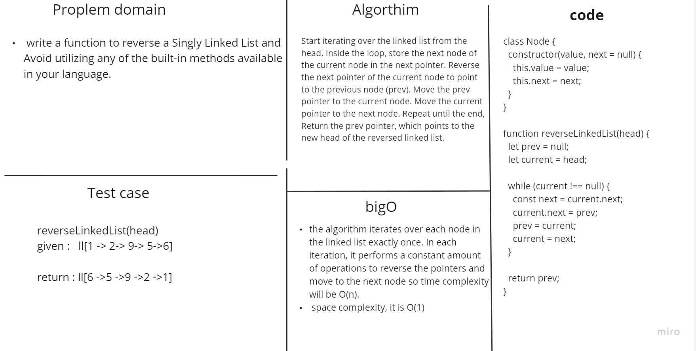

# reverseSinglyLinkedList


## white board




## Solution

``` javascript
class Node {
    constructor(data) {
        this.data = data;
        this.next = null;
    }
}

function reverseLinkedList(head) {
    let prev = null;
    let current = head;

    while (current !== null) {
        const next = current.next;
        current.next = prev;
        prev = current;
        current = next;
    }

    return prev;
}


```


