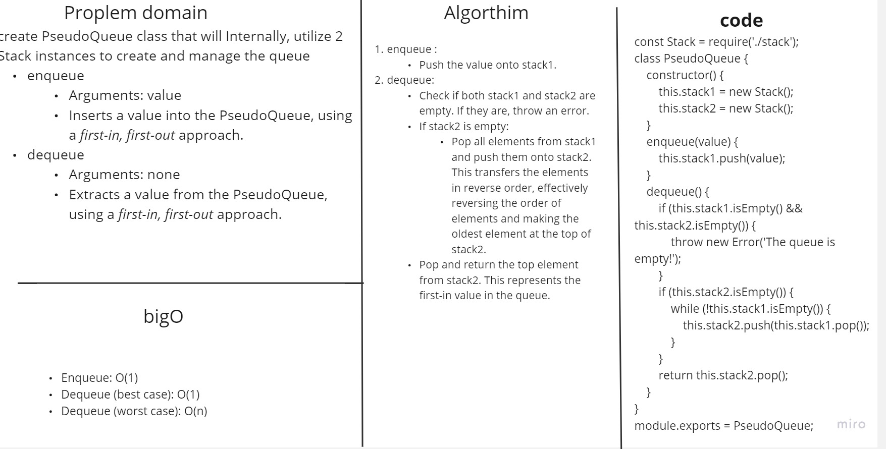

# Stack Queue Pseudo
Implement a Queue using two Stacks.

## Whiteboard Process


## Approach & Efficiency
The enqueue method simply pushes the value onto stack1, which has an complexity  of O(1) since it involves a single operation.

The dequeue method checks if both stack1 and stack2 are empty. If they are, it throws an error, which takes O(1) time.

If stack2 is empty, the method transfers elements from stack1 to stack2 by popping from stack1 and pushing onto stack2. This process takes O(n) time ,However, subsequent dequeue operations will directly pop elements from stack2, which has a complexity of O(1) .
The dequeue method pops and returns the top element from stack2, which represents the first-in value in the queue. This operation has an efficiency of O(1) since it involves a single operation.

## Solution
 ```javascript

const Stack = require('./stack');
class PseudoQueue {
    constructor() {
        this.stack1 = new Stack();
        this.stack2 = new Stack();
    }

    enqueue(value) {
        this.stack1.push(value);
    }

    dequeue() {
        if (this.stack1.isEmpty() && this.stack2.isEmpty()) {
            throw new Error('The queue is empty!');
        }

        if (this.stack2.isEmpty()) {
            while (!this.stack1.isEmpty()) {
                this.stack2.push(this.stack1.pop());
            }
        }

        return this.stack2.pop();
    }
    
}

module.exports = PseudoQueue;

    ```