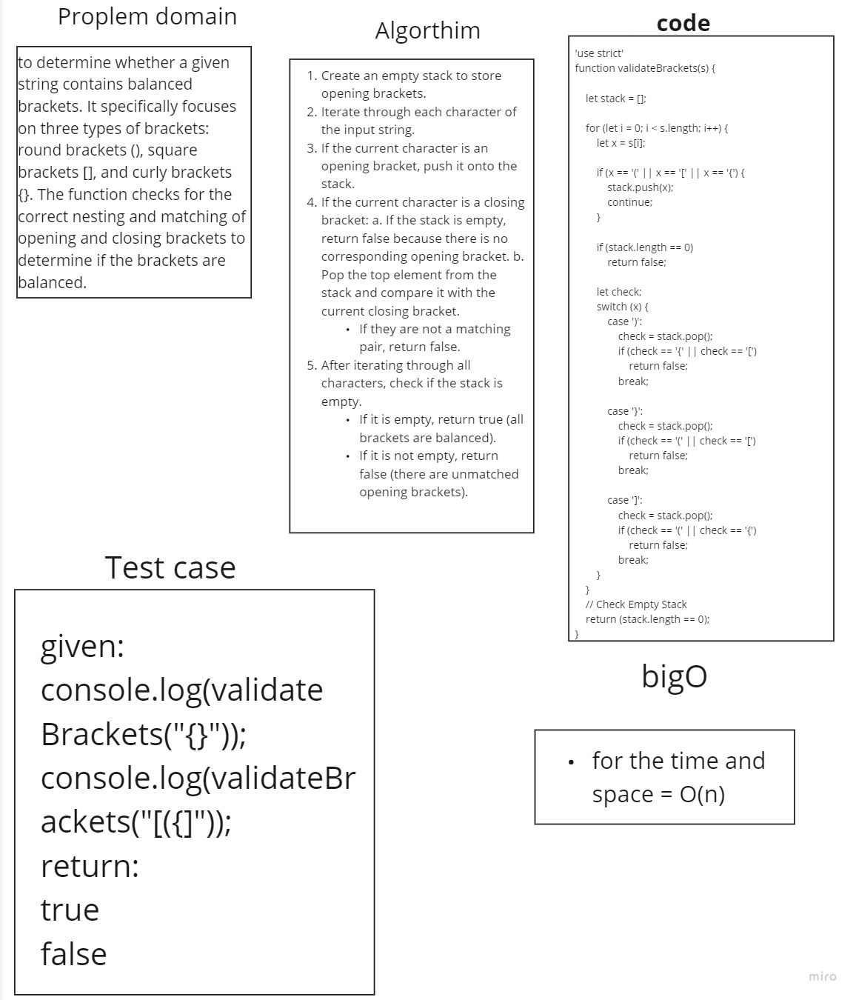

# Stack Queue Brackets

## Approach & Efficiency

1. The Algorithm:
It iterates through each character in the input string and performs the following steps:
If an opening bracket is encountered, it is pushed onto the stack.
If a closing bracket is encountered, it checks if the stack is empty or if the  opening bracket matches the current closing bracket. If either condition is not met, it returns False indicating unbalanced brackets.
After iterating through all characters, it checks if there are any remaining opening brackets in the stack. If there are, it returns False. Otherwise, it returns True, indicating balanced brackets.

2. Complexity: it is O(n), where n is the length of the input string. This is because the algorithm iterates through each character of the string exactly once.

## Whiteboard 


## Solution

 ```javascript
function validateBrackets(S) {
    const stack = [];
    const LBracket = ['(', '[', '{'];
    const RBracket = [')', ']', '}'];
    const bracketPair = {
        '(': ')',
        '[': ']',
        '{': '}'
    };

    for (let i = 0; i < S.length; i++) {
        const char = S[i];
        if (LBracket.includes(char)) {
            stack.push(char);
        } else if (RBracket.includes(char)) {
            if (stack.length === 0 || bracketPair[stack.pop()] !== char) {
                return false;
            }
        }
    }

    return stack.length === 0;
}


    ```

