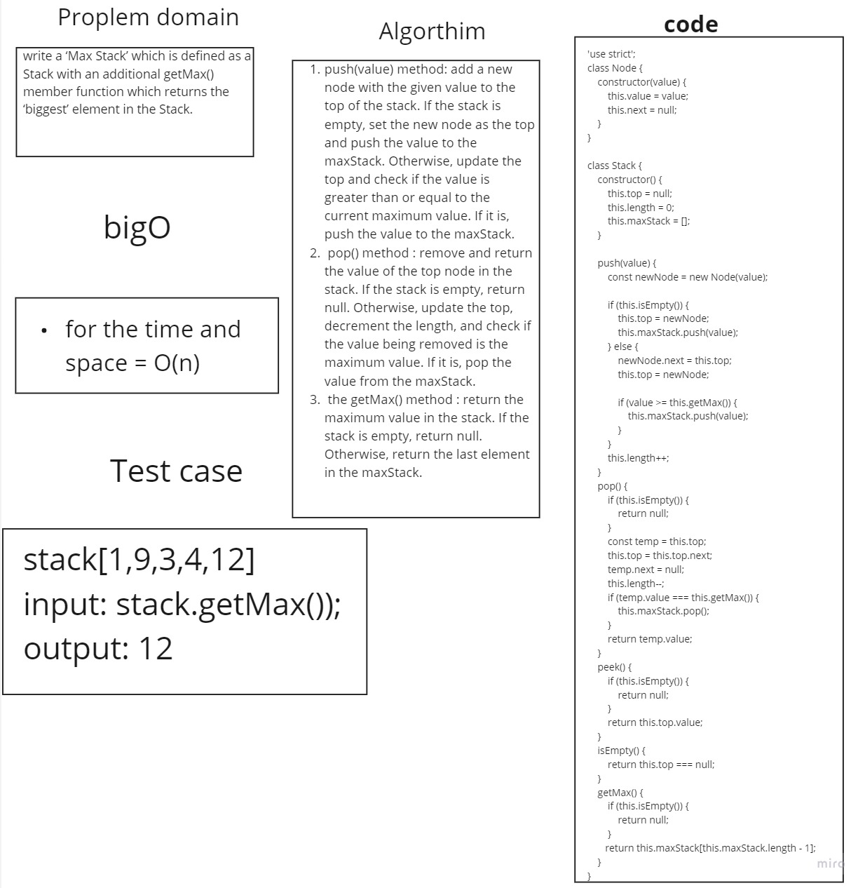

# Max stack
>a method that returns the “biggest” element in a stack.

[challenge](https://codefellows.github.io/common_curriculum/data_structures_and_algorithms/Code_401/class-14/interview-01.html)

## Whiteboard 


## Solution

 ```javascript
class Node {
    constructor(value) {
        this.value = value;
        this.next = null;
    }
}

class Stack {
    constructor() {
        this.top = null;
        this.length = 0;
        this.maxStack = [];
    }

    push(value) {
        const newNode = new Node(value);

        if (this.isEmpty()) {
            this.top = newNode;
            this.maxStack.push(value);
        } else {
            newNode.next = this.top;
            this.top = newNode;

            if (value >= this.getMax()) {
                this.maxStack.push(value);
            }
        }

        this.length++;
    }

    pop() {
        if (this.isEmpty()) {
            return null;
        }

        const temp = this.top;
        this.top = this.top.next;
        temp.next = null;
        this.length--;

        if (temp.value === this.getMax()) {
            this.maxStack.pop();
        }

        return temp.value;
    }

    peek() {
        if (this.isEmpty()) {
            return null;
        }

        return this.top.value;
    }

    isEmpty() {
        return this.top === null;
    }

    getMax() {
        if (this.isEmpty()) {
            return null;
        }

        return this.maxStack[this.maxStack.length - 1];
    }
}

    ```

