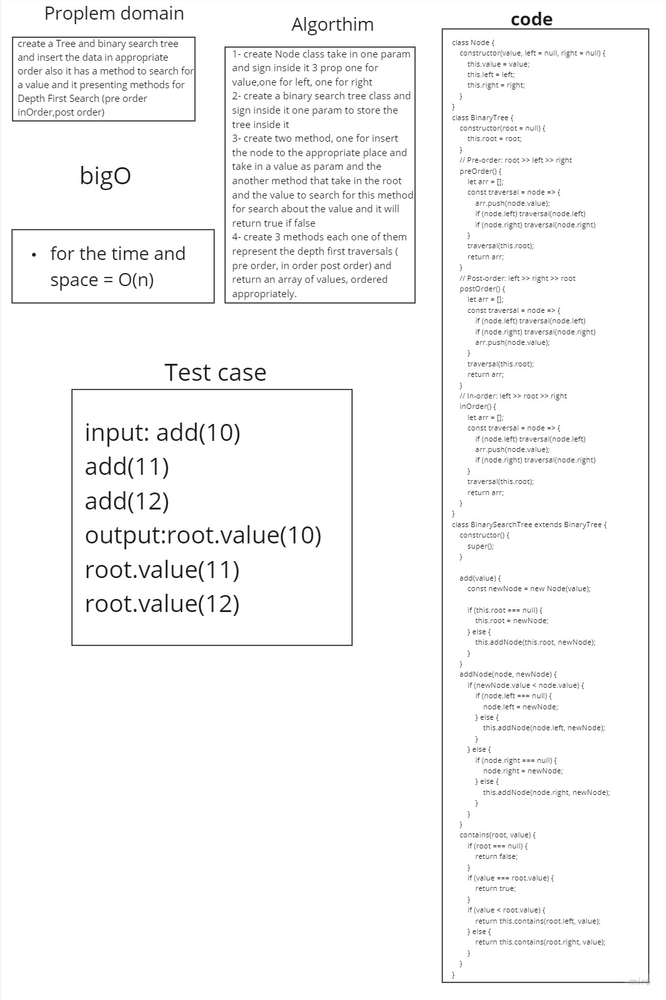

# Binary Search Tree

## Whiteboard 


## Solution

 ```javascript
'use strict';
class Node {
    constructor(value, left = null, right = null) {
        this.value = value;
        this.left = left;
        this.right = right;
    }
}


class BinaryTree {
    constructor(root = null) {
        this.root = root;
    }

    // Pre-order: root >> left >> right
    preOrder() {
        let arr = [];
        const traversal = node => {
            arr.push(node.value);
            if (node.left) traversal(node.left)
            if (node.right) traversal(node.right)
        }

        traversal(this.root);
        return arr;
    }

    // Post-order: left >> right >> root
    postOrder() {
        let arr = [];
        const traversal = node => {
            if (node.left) traversal(node.left)
            if (node.right) traversal(node.right)
            arr.push(node.value);
        }

        traversal(this.root);
        return arr;
    }

    // In-order: left >> root >> right
    inOrder() {
        let arr = [];
        const traversal = node => {
            if (node.left) traversal(node.left)
            arr.push(node.value);
            if (node.right) traversal(node.right)
        }

        traversal(this.root);
        return arr;
    }
}

class BinarySearchTree extends BinaryTree {
    constructor() {
        super();
    }

    add(value) {
        const newNode = new Node(value);

        if (this.root === null) {
            this.root = newNode;
        } else {
            this.addNode(this.root, newNode);
        }
    }

    addNode(node, newNode) {
        if (newNode.value < node.value) {
            if (node.left === null) {
                node.left = newNode;
            } else {
                this.addNode(node.left, newNode);
            }
        } else {
            if (node.right === null) {
                node.right = newNode;
            } else {
                this.addNode(node.right, newNode);
            }
        }
    }


    contains(root, value) {
        if (root === null) {
            return false;
        }

        if (value === root.value) {
            return true;
        }

        if (value < root.value) {
            return this.contains(root.left, value);
        } else {
            return this.contains(root.right, value);
        }
    }
}


    ```

