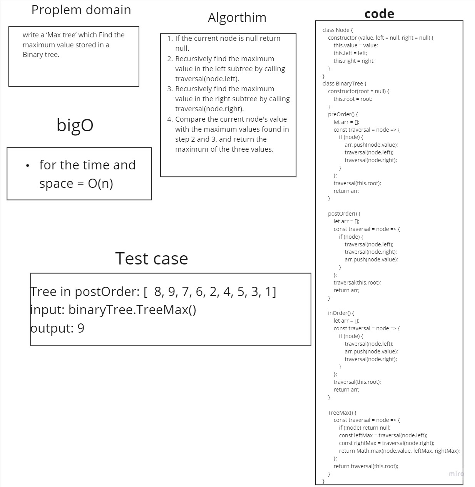

# Tree Max 
> Find the Maximum Value in a Binary Tree

## Whiteboard 


## Solution

 ```javascript
class Node {
    constructor (value, left = null, right = null) {
        this.value = value;
        this.left = left;
        this.right = right;
    }
}
class BinaryTree {
    constructor(root = null) {
        this.root = root;
    }

    preOrder() {
        let arr = [];
        const traversal = node => {
            if (node) {
                arr.push(node.value);
                traversal(node.left);
                traversal(node.right);
            }
        };
        traversal(this.root);
        return arr;
    }

    postOrder() {
        let arr = [];
        const traversal = node => {
            if (node) {
                traversal(node.left);
                traversal(node.right);
                arr.push(node.value);
            }
        };
        traversal(this.root);
        return arr;
    }

    inOrder() {
        let arr = [];
        const traversal = node => {
            if (node) {
                traversal(node.left);
                arr.push(node.value);
                traversal(node.right);
            }
        };
        traversal(this.root);
        return arr;
    }

    TreeMax() {
        const traversal = node => {
            if (!node) return null;
            const leftMax = traversal(node.left);
            const rightMax = traversal(node.right);
            return Math.max(node.value, leftMax, rightMax);
        };
        return traversal(this.root);
    }
}
    ```
