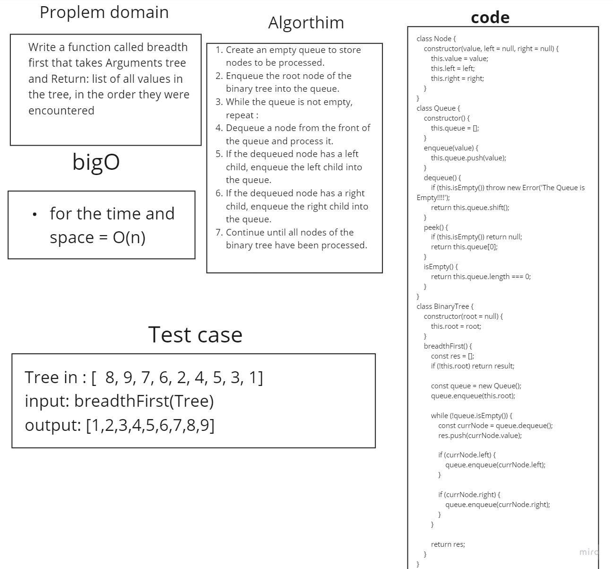

# Breadth-first Traversal
Write a function called breadth first
Arguments: tree
Return: list of all values in the tree, in the order they were encountered

## Whiteboard 


## Solution

 ```javascript
 
 class Node {
    constructor(value, left = null, right = null) {
        this.value = value;
        this.left = left;
        this.right = right;
    }
}

class Queue {
    constructor() {
        this.queue = [];
    }
    enqueue(value) {
        this.queue.push(value);
    }
    dequeue() {
        if (this.isEmpty()) throw new Error('The Queue is Empty!!!!');
        return this.queue.shift();
    }

    peek() {
        if (this.isEmpty()) return null;
        return this.queue[0];
    }

    isEmpty() {
        return this.queue.length === 0;
    }
}

class BinaryTree {
    constructor(root = null) {
        this.root = root;
    }

    breadthFirst() {
        const res = [];
        if (!this.root) return result;

        const queue = new Queue();
        queue.enqueue(this.root);

        while (!queue.isEmpty()) {
            const currNode = queue.dequeue();
            res.push(currNode.value);

            if (currNode.left) {
                queue.enqueue(currNode.left);
            }

            if (currNode.right) {
                queue.enqueue(currNode.right);
            }
        }

        return res;
    }
}
     ```
