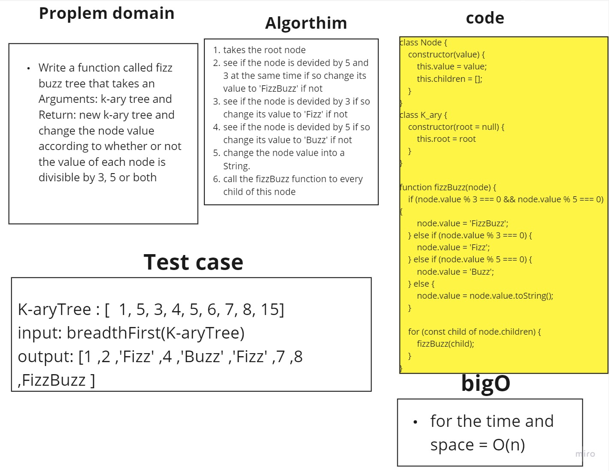

# Tree fizz Buzz Tree

Write a function called fizz buzz tree
Arguments: k-ary tree
Return: new k-ary tree

Determine whether or not the value of each node is divisible by 3, 5 or both. Create a new tree with the same structure as the original, but the values modified as follows:

- If the value is divisible by 3, replace the value with “Fizz”
- If the value is divisible by 5, replace the value with “Buzz”
- If the value is divisible by 3 and 5, replace the value with “FizzBuzz”
- If the value is not divisible by 3 or 5, simply turn the number into a String.
## Whiteboard 


## Solution

 ```javascript
 
class Node {
    constructor(value) {
        this.value = value;
        this.children = [];
    }
}

class K_ary {
    constructor(root = null) {
        this.root = root
    }
}

function fizzBuzz(node) {
    if (node.value % 3 === 0 && node.value % 5 === 0) {
        node.value = 'FizzBuzz';
    } else if (node.value % 3 === 0) {
        node.value = 'Fizz';
    } else if (node.value % 5 === 0) {
        node.value = 'Buzz';
    } else {
        node.value = node.value.toString();
    }

    for (const child of node.children) {
        fizzBuzz(child);
    }
}
      ```
