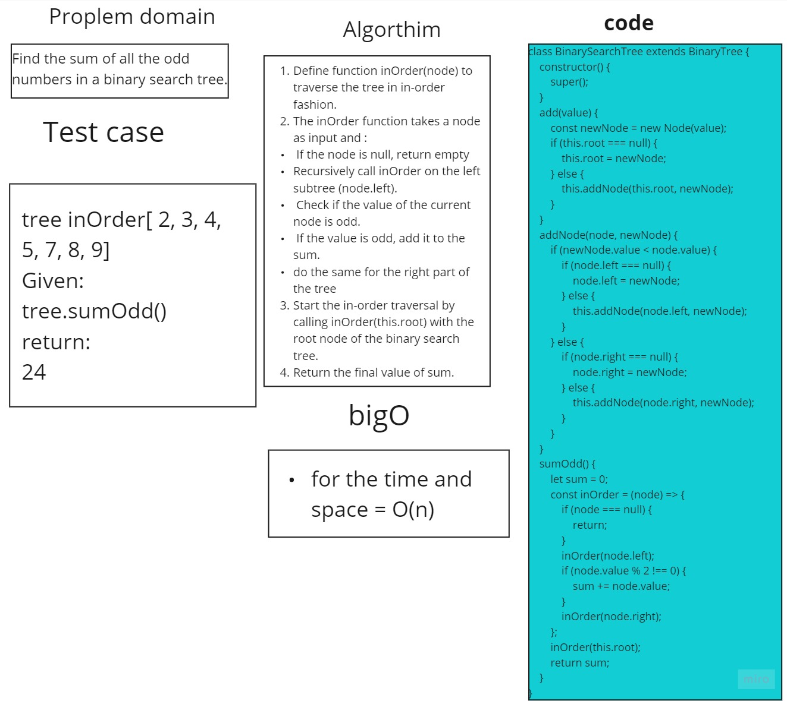

# Binary Search  (Sum Of Odd)
> Sum of all the odd numbers in a binary search tree

## Whiteboard 


## Solution

 ```javascript
class BinarySearchTree extends BinaryTree {
    constructor() {
        super();
    }
    add(value) {
        const newNode = new Node(value);

        if (this.root === null) {
            this.root = newNode;
        } else {
            this.addNode(this.root, newNode);
        }
    }


    sumOdd() {
        let sum = 0;

        const inOrder = (node) => {
            if (node === null) {
                return;
            }
            inOrder(node.left);
            if (node.value % 2 !== 0) {
                sum += node.value;
            }
            inOrder(node.right);
        };
        inOrder(this.root);
        return sum;
    }
}

    ```

