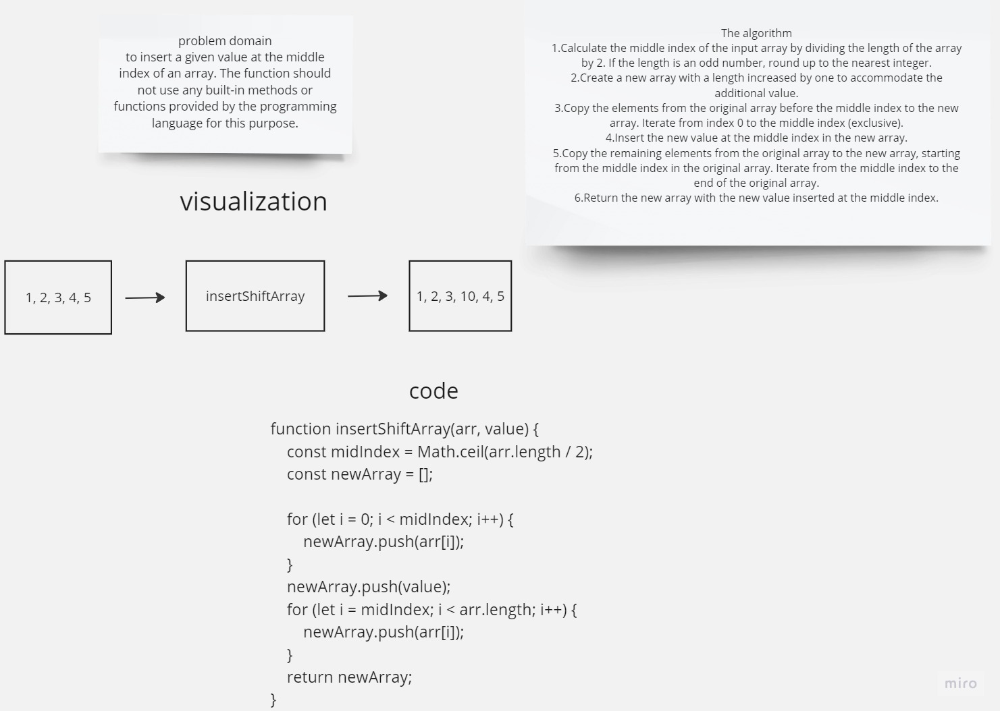
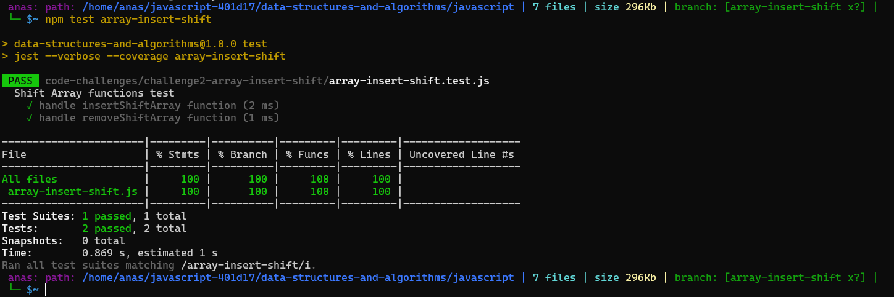

# array-insert-shift
> Write a function called insertShiftArray which takes in an array and a value to be added. Without utilizing any of the built-in methods available to your language, return an array with the new value added at the middle index.

## Whiteboard Process



## Approach & Efficiency
>BigO = O(1) => it's a one process that takes the same time independently of how bigger the variables are, so it's a constant time ratio with process.
>Space: complexity is 0(0) since we arendadding any new significant space in our memory, the same array is returned but changed.## Solution

``` JavaScript
function insertShiftArray(arr, value) {
    const midIndex = Math.ceil(arr.length / 2);
    const newArray = [];

    for (let i = 0; i < midIndex; i++) {
        newArray.push(arr[i]);
    }

    newArray.push(value);

    for (let i = midIndex; i < arr.length; i++) {
        newArray.push(arr[i]);
    }

    return newArray;
}
//Stretch Goal
function removeShiftArray(arr) {
    const midIndex = Math.floor(arr.length / 2);

    const newArray = [];

    for (let i = 0; i < midIndex; i++) {
        newArray.push(arr[i]);
    }

    for (let i = midIndex + 1; i < arr.length; i++) {
        newArray.push(arr[i]);
    }

    return newArray;
}

```



> to run the test (npm test array-insert-shift)
