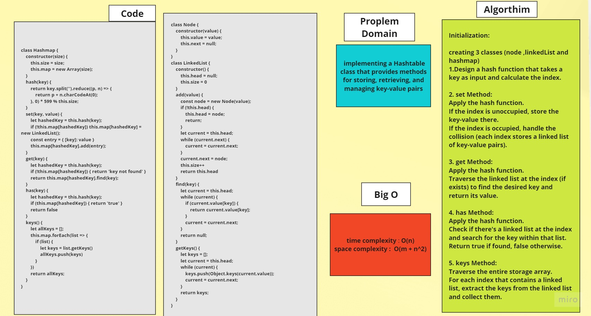

# Hash Table

## Feature Tasks

Implement a Hashtable Class with the following methods:

1. set
- Arguments: key, value
- Returns: nothing
- This method should hash the key, and set the key and value pair in the table, handling collisions as needed.
- Should a given key already exist, replace its value from the value argument given to this method.

2. get
- Arguments: key
- Returns: Value associated with that key in the table

3. has
- Arguments: key
- Returns: Boolean, indicating if the key exists in the table already.

4. keys
- Returns: Collection of keys

5. hash
- Arguments: key
- Returns: Index in the collection for that key

## Algorthim

Initialization:

creating 3 classes (node ,linkedList and hashmap)
1. Design a hash function that takes a key as input and calculate the index.

2. set Method:
Apply the hash function.
If the index is unoccupied, store the key-value there.
If the index is occupied, handle the collision (each index stores a linked list of key-value pairs).

3. get Method:
Apply the hash function.
Traverse the linked list at the index (if exists) to find the desired key and return its value.

4. has Method:
Apply the hash function.
Check if there's a linked list at the index and search for the key within that list. Return true if found, false otherwise.

5. keys Method:
Traverse the entire storage array.
For each index that contains a linked list, extract the keys from the linked list and collect them.

## Whiteboard

> to run (node hashTable.js)

> to test (npm test node hashTable.test.js)