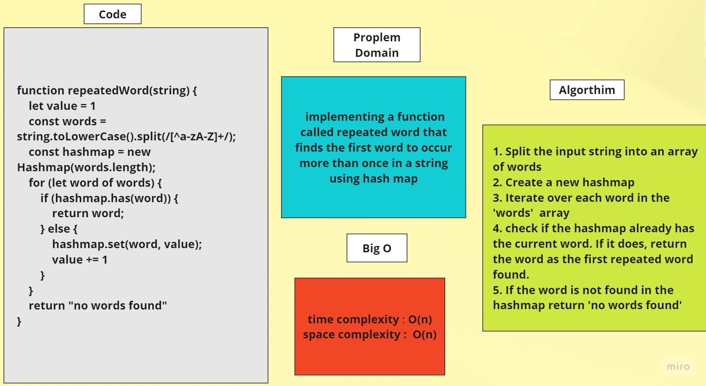

# Hashmap Repeated Word

## Feature Tasks

> Write a function called repeated word that finds the first word to occur more than once in a string 

> Arguments: string

> Return: string

## Algorthim
1. Split the input string into an array of words
2. Create a new hashmap
3. Iterate over each word in the 'words'  array
4. check if the hashmap already has the current word. If it does, return the word as the first repeated word found.
5. If the word is not found in the hashmap return 'no words found'

## Whiteboard

> to run (node hashmap-repeated-word.js)
