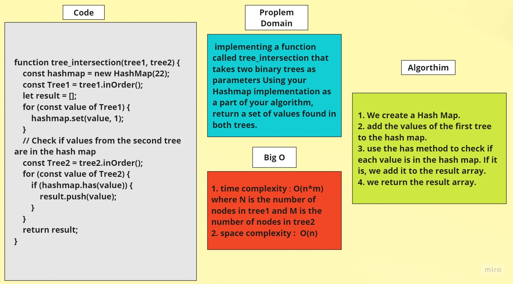

# Tree Intersection
	> to run (node tree-intersection.js)

## Problem Domain

- Write a function called tree_intersection that takes two binary trees as parameters.
- Return a set of values found in both trees using your Hashmap implementation as part of your algorithm.

	
## Whiteboard


	


## Code 

```javascript
function tree_intersection(tree1, tree2) {
	const hashmap = new HashMap(22);
	const Tree1 = tree1.inOrder();
	let result = [];

	for (const value of Tree1) {
		hashmap.set(value, 1);
	}
	// Check if values from the second tree are in the hash map
	const Tree2 = tree2.inOrder();
	for (const value of Tree2) {
		if (hashmap.has(value)) {
			result.push(value);			
		}
	}
	return result;
}
```
## Algorithm
1. Create a Hash Map.
2. Add the values of the first tree to the hash map.
3. Use the has method to check if each value is in the hash map. If it is, we add it to the result array.
4. Return the result array.
