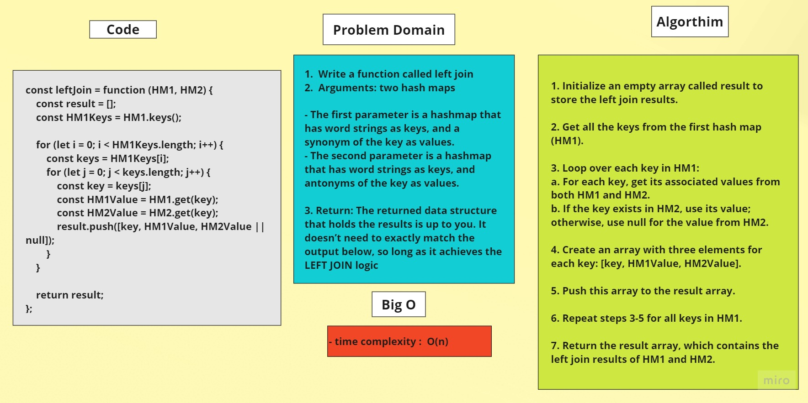

# Left Join

## Problem Domain

1.  Write a function called left join

2.  Arguments: two hash maps

- The first parameter is a hashmap that has word strings as keys, and a synonym of the key as values.
- The second parameter is a hashmap that has word strings as keys, and antonyms of the key as values.

3. Return: The returned data structure that holds the results is up to you. It doesn’t need to exactly match the output below, so long as it achieves the LEFT JOIN logic

	
## Whiteboard


	


## Code 

```javascript
const leftJoin = function (HM1, HM2) {
	const result = [];

	const HM1Keys = HM1.keys();

	for (let i = 0; i < HM1Keys.length; i++) {
		const keys = HM1Keys[i];
		for (let j = 0; j < keys.length; j++) {
			const key = keys[j];
			const HM1Value = HM1.get(key);
			const HM2Value = HM2.get(key);
			result.push([key, HM1Value, HM2Value || null]);
		}
	}

	return result;
};
```
## Algorithm

1. Initialize an empty array called result to store the left join results.

2. Get all the keys from the first hash map (HM1).

3. Loop over each key in HM1:

- For each key, get its associated values from both HM1 and HM2.
- If the key exists in HM2, use its value; otherwise, use null for the value from HM2.

4. Create an array with three elements for each key: [key, HM1Value, HM2Value].

5. Push this array to the result array.

6. Repeat steps 3-5 for all keys in HM1.

7. Return the result array, which contains the left join results of HM1 and HM2.

