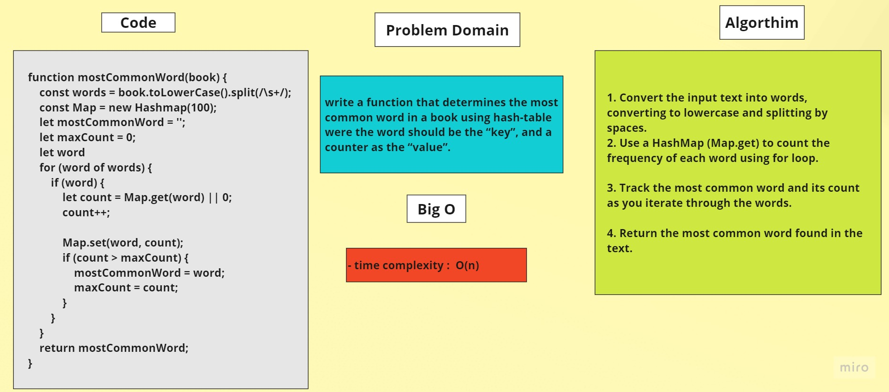

# hash Table (most common word in a book)
	

## Problem Domain
-  write a function that determines the most common word in a book.

-  The most efficient solution to this problem is to use a hash-table.

-  The function created should take in a string as an argument.

-  The best approach to this is to iterate through the string and to keep a “tally” of how many times a word appears.

-  the word should be the “key”, and a counter as the “value”.

-  The word with the highest counter at the end is the returned word.

-  It is possible for the candidate to have a “tempWord” and “tempCounter” that will hold the highest word and count so far. This will prevent them from having to iterate through the hash-table once the string is completed.

- Time and Space is O(n).

## Whiteboard


	

## Code 

```javascript
function mostCommonWord(book) {
	const words = book.toLowerCase().split(/\s+/);
	const Map = new Hashmap(100);

	let mostCommonWord = '';
	let maxCount = 0;
	let word
	for (word of words) {
		if (word) {
			let count = Map.get(word) || 0;
			count++;

			Map.set(word, count);
			if (count > maxCount) {
				mostCommonWord = word;
				maxCount = count;
			}
		}
	}
	return mostCommonWord;
}

```
## Algorithm

1. Convert the input text into words, converting to lowercase and splitting by spaces.

2. Use a HashMap (Map.get) to count the frequency of each word using for loop.

3. Track the most common word and its count as you iterate through the words.

4. Return the most common word found in the text.