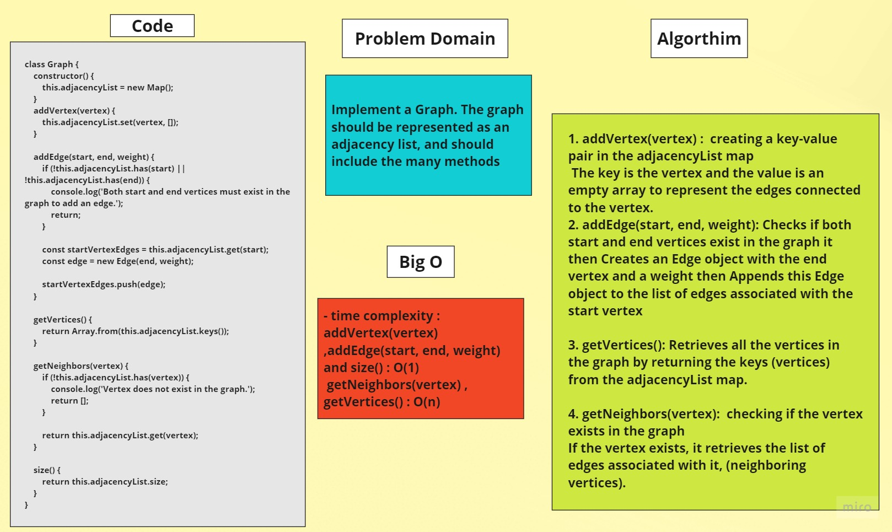

# Graphs
	> to run (node Graphs.js)

## Problem Domain
> Implement a Graph. The graph should be represented as an adjacency list, and should include the many methods.
	
## Whiteboard


	


## Code 

```javascript
class Graph {
	constructor() {
		this.adjacencyList = new Map();
	}

	addVertex(vertex) {
		this.adjacencyList.set(vertex, []);
	}

	addEdge(start, end, weight) {
		if (!this.adjacencyList.has(start) || !this.adjacencyList.has(end)) {
			console.log('Both start and end vertices must exist in the graph to add an edge.');
			return;
		}

		const startVertexEdges = this.adjacencyList.get(start);
		const edge = new Edge(end, weight);

		startVertexEdges.push(edge);
	}

	getVertices() {
		return Array.from(this.adjacencyList.keys());
	}

	getNeighbors(vertex) {
		if (!this.adjacencyList.has(vertex)) {
			console.log('Vertex does not exist in the graph.');
			return null;
		}

		return this.adjacencyList.get(vertex);
	}

	size() {
		return this.adjacencyList.size;
	}
}

```
## Algorithm
1. addVertex(vertex) :  creating a key-value pair in the adjacencyList map
 The key is the vertex and the value is an empty array to represent the edges connected to the vertex.

2. addEdge(start, end, weight): Checks if both start and end vertices exist in the graph it then Creates an Edge object with the end vertex and a weight then Appends this Edge object to the list of edges associated with the start vertex 

3. getVertices(): Retrieves all the vertices in the graph by returning the keys (vertices) from the adjacencyList map.

4. getNeighbors(vertex):  checking if the vertex exists in the graph 
If the vertex exists, it retrieves the list of edges associated with it, (neighboring vertices).

5. size(): Calculates the total number of vertices in the graph by getting the size of the adjacencyList map.

