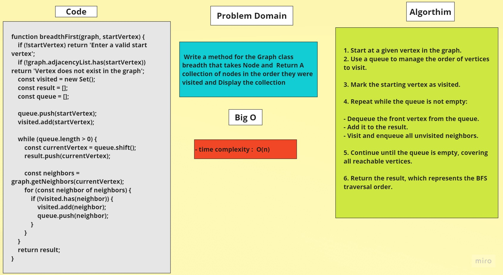

# Graphs
> breadthFirst

> to run (node index.js)

## Problem Domain
> Write a method for the Graph class breadth that takes Node and  Return A collection of nodes in the order they were visited and Display the collection
	
## Whiteboard


	


## Code 

```javascript
function breadthFirst(graph, startVertex) {
	if (!startVertex) return 'Enter a valid start vertex';
	if (!graph.adjacencyList.has(startVertex)) return 'Vertex does not exist in the graph';

	const visited = new Set();
	const result = [];
	const queue = [];

	queue.push(startVertex);
	visited.add(startVertex);

	while (queue.length > 0) {
		const currentVertex = queue.shift();
		result.push(currentVertex);

		const neighbors = graph.getNeighbors(currentVertex);
		for (const neighbor of neighbors) {
			if (!visited.has(neighbor)) {
				visited.add(neighbor);
				queue.push(neighbor);
			}
		}
	}
	return result;
}

```
## Algorithm


1. Start at a given vertex in the graph.

2. Use a queue to manage the order of vertices to visit.

3. Mark the starting vertex as visited.

4. Repeat while the queue is not empty:

- Dequeue the front vertex from the queue.
- Add it to the result.
- Visit and enqueue all unvisited neighbors.

5. Continue until the queue is empty, covering all reachable vertices.

6. Return the result, which represents the BFS traversal order.

