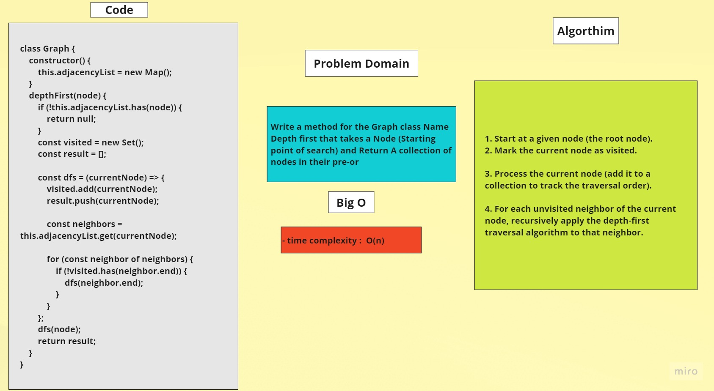

# Graphs (Graph Depth First)


## Problem Domain
> Write a method for the Graph class Name Depth first that takes a Node (Starting point of search) and Return A collection of nodes in their pre-or
	
## Whiteboard


	


## Code 

```javascript
class Graph {
	constructor() {
		this.adjacencyList = new Map();
	}

	depthFirst(node) {
		if (!this.adjacencyList.has(node)) {
			return null;
		}

		const visited = new Set();
		const result = [];

		const dfs = (currentNode) => {
			visited.add(currentNode);
			result.push(currentNode);

			const neighbors = this.adjacencyList.get(currentNode);

			for (const neighbor of neighbors) {
				if (!visited.has(neighbor.end)) {
					dfs(neighbor.end);
				}
			}
		};

		dfs(node);
		return result;
	}
}
```
## Algorithm

1. Start at a given node (the root node).

2. Mark the current node as visited.

3. Process the current node (add it to a collection to track the traversal order).

4. For each unvisited neighbor of the current node, recursively apply the depth-first traversal algorithm to that neighbor.
