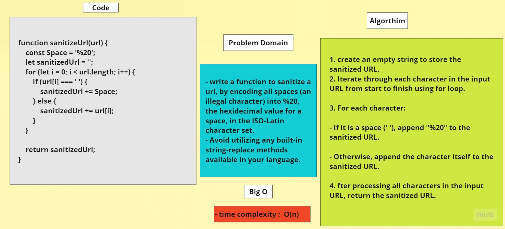

# Sanitized Url


## Problem Domain

- write a function to sanitize a url, by encoding all spaces (an illegal character) into %20, the hexidecimal value for a space, in the ISO-Latin character set.
- Avoid utilizing any built-in string-replace methods available in your language.

## Whiteboard


	


## Code 

```javascript
function sanitizeUrl(url) {
	const Space = '%20';
	let sanitizedUrl = '';

	for (let i = 0; i < url.length; i++) {
		if (url[i] === ' ') {
			sanitizedUrl += Space;
		} else {
			sanitizedUrl += url[i];
		}
	}

	return sanitizedUrl;
}

```
## Algorithm

1. create an empty string to store the sanitized URL.

2. Iterate through each character in the input URL from start to finish using for loop.

3. For each character:

- If it is a space (' '), append "%20" to the sanitized URL.

- Otherwise, append the character itself to the sanitized URL.

4. fter processing all characters in the input URL, return the sanitized URL.

