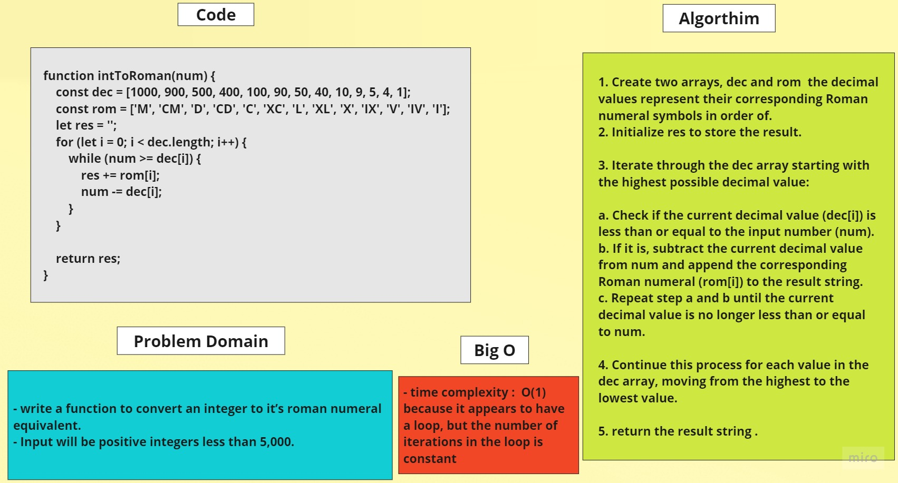

# Converting years to Roman Numerals


## Problem Domain

- write a function to convert an integer to it’s roman numeral equivalent.
- Input will be positive integers less than 5,000.


## Whiteboard


	


## Code 

```javascript
function intToRoman(num) {
	const dec = [1000, 900, 500, 400, 100, 90, 50, 40, 10, 9, 5, 4, 1];
	const rom = ['M', 'CM', 'D', 'CD', 'C', 'XC', 'L', 'XL', 'X', 'IX', 'V', 'IV', 'I'];
	let res = '';

	for (let i = 0; i < dec.length; i++) {
		while (num >= dec[i]) {
			res += rom[i];
			num -= dec[i];
		}
	}

	return res;
}

```
## Big O

 - it appears to have a loop, but the number of iterations in the loop is constant

## Algorithm


1. Create two arrays, dec and rom  the decimal values represent their corresponding Roman numeral symbols in order of.

2. Initialize res to store the result.

3. Iterate through the dec array starting with the highest possible decimal value:

a. Check if the current decimal value (dec[i]) is less than or equal to the input number (num).

b. If it is, subtract the current decimal value from num and append the corresponding Roman numeral (rom[i]) to the result string.

c. Repeat step a and b until the current decimal value is no longer less than or equal to num.

4. Continue this process for each value in the dec array, moving from the highest to the lowest value.

5. return the result string .