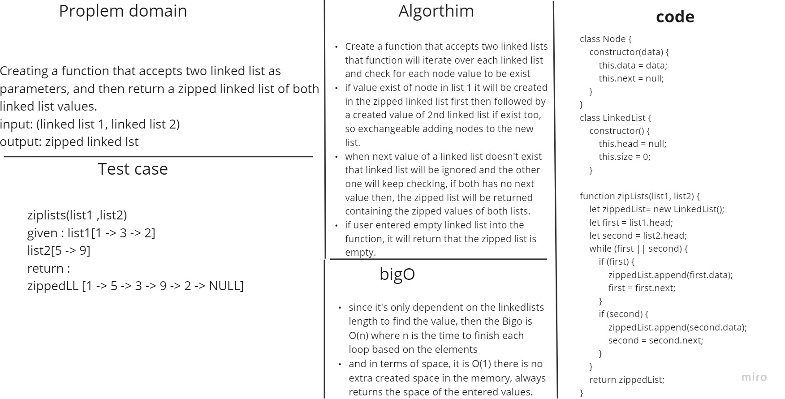

# Linked Lists Zipped List

Write a function  that takes two linked list , and Zip the two linked lists together into one so that the nodes alternate between the two lists and return a reference to the the zipped list.

## Whiteboard Process



## Solution

``` javascript
class Node {
    constructor(data) {
        this.data = data;
        this.next = null;
    }
}

class LinkedList {
    constructor() {
        this.head = null;
        this.size = 0;
    }

    append(value) {
        const newNode = new Node(value);
        if (!this.head) {
            this.head = newNode;
        } else {
            let current = this.head;
            while (current.next) {
                current = current.next;
            }
            current.next = newNode;
        }
        this.size++;
    }

    includes(value) {
        let start = this.head;
        if (!this.head) {
            return false;
        } else {
            while (start.data !== value) {
                if (start.next === null) return false;
                start = start.next;
            }
            return true;
        }
    }

    toString() {
        let start = this.head;
        if (!this.head) {
            return 'empty linked list';
        } else {
            let stringOfValues = '';
            while (start) {
                stringOfValues += `${start.data} -> `;
                if (start.next === null) {
                    stringOfValues += 'NULL';
                    return stringOfValues;
                }
                start = start.next;
            }
        }
    }

}

function zipLists(list1, list2) {
    let zippedList = new LinkedList();
    let first = list1.head;
    let second = list2.head;
    while (first || second) {
        if (first) {
            zippedList.append(first.data);
            first = first.next;
        }
        if (second) {
            zippedList.append(second.data);
            second = second.next;
        }
    }
    return zippedList;
}


```

## For Tests (npm test javascript/code-challenges/challenge8-linked-list-zip)